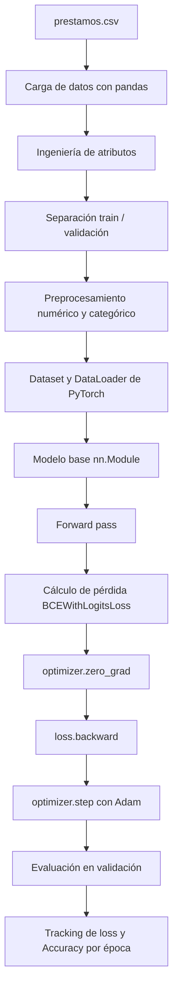

# Pipeline Base de Deep Learning - Riesgo Crediticio

## Objetivo

Este checkpoint implementa un pipeline base de entrenamiento y validación en PyTorch para un problema de clasificación binaria usando el dataset `prestamos.csv`.

La variable objetivo es `loan_status`:

- `1`: crédito aprobado / perfil apto.
- `0`: crédito no aprobado / perfil riesgoso.

El foco de esta entrega no es construir el modelo más complejo, sino demostrar una infraestructura clara, reproducible y funcional para entrenar y validar un clasificador base.

## Estructura del repositorio

```text
modulo_iii_pipeline_dl/
├── data/
│   └── prestamos.csv
├── src/
│   └── train.py
├── README.md
└── requirements.txt
```

## Configuración del entorno

Crear un entorno virtual e instalar dependencias:

```bash
pip install -r requirements.txt
```

El script detecta automáticamente el dispositivo de ejecución disponible:

- `cuda`, si hay GPU NVIDIA compatible.
- `mps`, si se ejecuta en Apple Silicon.
- `cpu`, si no hay acelerador disponible.

## Cómo ejecutar el entrenamiento

Desde la carpeta `modulo_iii_pipeline_dl`:

```bash
python src/train.py
```

También se pueden modificar hiperparámetros desde consola:

```bash
python src/train.py --epochs 15 --batch-size 256 --learning-rate 0.001
```

## Arquitectura base

Se utiliza un MLP simple implementado como `nn.Module`:

- Capa lineal de entrada.
- Activación `ReLU`.
- `Dropout` para regularización.
- Segunda capa lineal.
- Activación `ReLU`.
- Capa de salida binaria.

La pérdida utilizada es `BCEWithLogitsLoss`, adecuada para clasificación binaria. El optimizador elegido es `Adam`.

## Hiperparámetros iniciales

- `learning_rate`: `0.001`
- `batch_size`: `128`
- `epochs`: `10`
- `optimizer`: `Adam`
- `loss`: `BCEWithLogitsLoss`

El learning rate `0.001` se eligió como punto de partida estándar para Adam, ya que suele ofrecer una convergencia estable en redes pequeñas.

## Pipeline implementado

El script incluye:

- Fijación de semillas de aleatoriedad.
- Detección automática de dispositivo.
- Carga del dataset.
- Ingeniería de atributos simple.
- Separación train/validación con `train_test_split`.
- Preprocesamiento de variables numéricas y categóricas.
- Construcción de `Dataset` y `DataLoader`.
- Definición del clasificador base con `nn.Module`.
- Training loop explícito:
  - `forward pass`
  - cálculo de pérdida
  - `optimizer.zero_grad()`
  - `loss.backward()`
  - `optimizer.step()`
- Ciclo de validación con `model.eval()` y `torch.no_grad()`.
- Tracking de pérdida y Accuracy por época.

## Diagrama conceptual del pipeline



## Resultados esperados

Durante las épocas, el script imprime:

- `train_loss`
- `train_accuracy`
- `val_loss`
- `val_accuracy`

Además, genera el archivo:

```text
training_history.csv
```

Este archivo permite revisar la evolución de la pérdida y la métrica de desempeño por época.

## Interpretación de la curva de pérdida

Si el pipeline aprende correctamente, se espera que la pérdida de entrenamiento disminuya a medida que avanzan las épocas. La pérdida de validación también debería bajar o mantenerse estable. Si la pérdida de entrenamiento baja pero la de validación sube, eso puede indicar overfitting.

Este primer checkpoint funciona como infraestructura base para próximos modelos más complejos.
